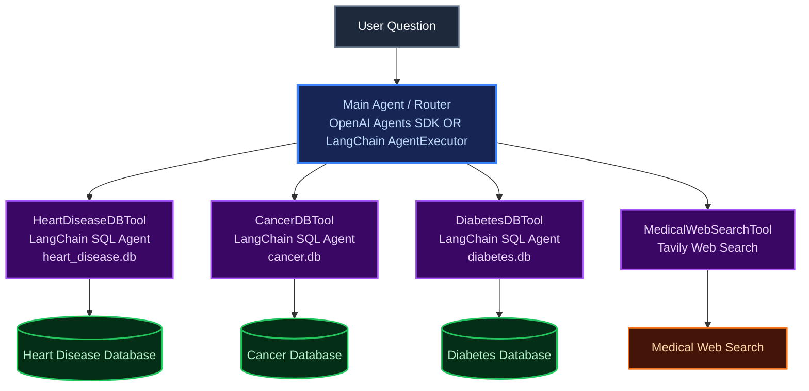

# Medical Multi-Tool AI Agent

A multi-tool AI agent that answers questions about three medical datasets (Heart
Disease, Cancer, Diabetes) via SQL, and falls back to live web search for general
medical knowledge (definitions, symptoms, causes, treatments).

Two interchangeable orchestration layers are included:

| File                      | Framework                                                                           |
| ------------------------- | ----------------------------------------------------------------------------------- |
| `agent/agents_sdk_app.py` | **OpenAI Agents SDK** (`Agent`, `Runner`, `function_tool`) — primary implementation |
| `agent/langchain_app.py`  | **LangChain `AgentExecutor`** (`initialize_agent`) — alternative implementation     |

Both wrap the exact same four tools, each of which is implemented under the hood
with a **LangChain SQL Agent** (`SQLDatabaseToolkit` + `create_sql_agent`), so the SQL
generation/execution logic is shared and identical no matter which top-level agent
you run.



## Try it on Colab:

[](https://colab.research.google.com/drive/1DNk250sMrrrB2nO8Ik-YQhBdpIz2YbVN?usp=sharing)

## 1. Project structure

```
📁 medical-agent/
├── 📁 data/                     # raw CSVs live here (gitignored except README)
│   └── README.md             # exact filenames/columns expected + Kaggle links
├── 📁 db/                       # generated SQLite databases (gitignored)
├── 📁 scripts/
│   ├── generate_sample_data.py   # optional: synthetic CSVs for a quick demo
│   └── csv_to_sqlite.py          # CSV -> typed SQLite conversion
├── 📁 tools/
│   ├── db_core.py            # shared LangChain SQL-agent builder
│   ├── heart_tool.py         # HeartDiseaseDBTool
│   ├── cancer_tool.py        # CancerDBTool
│   ├── diabetes_tool.py      # DiabetesDBTool
│   └── web_search_tool.py    # MedicalWebSearchTool (Tavily)
├── 📁 agent/
│   ├── agents_sdk_app.py     # main router agent (OpenAI Agents SDK)
│   └── langchain_app.py      # main router agent (LangChain AgentExecutor)
├── 📁 notebooks/
│   └── Medical_Agent_Colab.ipynb
├── main.py                   # CLI entry point for either backend
├── requirements.txt
└── .env.example
```

## 2. Setup

```bash
git clone https://github.com/MehdiHossenFahim/medical-agent.git
cd medical-agent

python3 -m venv .venv
source .venv/bin/activate        # Windows: .venv\Scripts\activate

pip install -r requirements.txt

cp .env.example .env
# then edit .env -- see the two options below
```

You need an LLM provider key and a Tavily key:

- A **Tavily API key** for `MedicalWebSearchTool` (free tier at https://app.tavily.com).
  You can swap in SerpAPI or Bing instead — see the note inside `tools/web_search_tool.py`.
- Either an **OpenAI API key**, or a **free Groq API key** (no OpenAI account needed).

### Option 1 — OpenAI

```env
LLM_PROVIDER=openai
OPENAI_API_KEY=sk-...
OPENAI_MODEL=gpt-4o-mini
```

### Option 2 — Groq (free tier, no OpenAI key required)

Get a free key at https://console.groq.com, then set:

```env
LLM_PROVIDER=groq
GROQ_API_KEY=gsk_...
GROQ_MODEL=openai/gpt-oss-20b
```

This works for **both** agent backends:

- The three `*DBTool`s' internal LangChain SQL agents pick up `LLM_PROVIDER` via
  `tools/db_core.py::get_llm()` and use `ChatGroq` automatically.
- `agent/langchain_app.py`'s router also calls `get_llm()`, so it runs on Groq too.
- `agent/agents_sdk_app.py`'s router (OpenAI Agents SDK) detects `LLM_PROVIDER=groq`
  and points itself at Groq's OpenAI-compatible endpoint
  (`https://api.groq.com/openai/v1`) using `OpenAIChatCompletionsModel` + a custom
  `AsyncOpenAI` client — no code changes needed, just the env vars above.

`openai/gpt-oss-20b` on Groq supports tool/function calling, which both the SQL
agents and the router agent rely on, so either backend works end-to-end on Groq alone.

> **Dependency note:** this was built/tested against a fast-moving stack (the OpenAI
> Agents SDK now requires `openai>=3.0`, and current LangChain 1.x moved
> `AgentExecutor`/`create_tool_calling_agent` into the `langchain-classic` package).
> `requirements.txt` already pins these correctly. If you install packages manually
> instead of via `pip install -r requirements.txt` and hit an import error for
> `AgentExecutor` or `ContextManagement`, install `langchain-classic` and/or bump
> `openai` to `>=3.0,<4`.

## 3. Get the data and build the databases

**Option A — real Kaggle datasets :**
Download the three datasets and place the CSVs at `data/heart.csv`, `data/cancer.csv`,
`data/diabetes.csv`. Full instructions and Kaggle links are in [`data/README.md`](data/README.md).

**Option B — quick synthetic demo (no Kaggle account needed):**

```bash
python scripts/generate_sample_data.py --rows 500
```

Then, either way, build the SQLite databases:

```bash
python scripts/csv_to_sqlite.py
```

This creates:

- `db/heart_disease.db` → table `heart_disease_records`
- `db/cancer.db` → table `cancer_records`
- `db/diabetes.db` → table `diabetes_records`

with SQL column types (`INTEGER` / `REAL` / `TEXT`) inferred from the CSV data.

## 4. Run the agent

**Interactive chat (OpenAI Agents SDK, default):**

```bash
python main.py
```

**Interactive chat (LangChain AgentExecutor):**

```bash
python main.py --backend langchain
```

**One-off question:**

```bash
python main.py "What is the average cholesterol level in the heart disease dataset?"
python main.py "How many patients in the diabetes dataset have an outcome of 1?"
python main.py "What are the symptoms of type 2 diabetes?"
python main.py "What causes lung cancer?"
```

You can also run either agent file directly:

```bash
python agent/agents_sdk_app.py "average BMI in the cancer dataset"
python agent/langchain_app.py "what is angina?"
```

## 5. How routing works

The main agent's instructions tell it:

- Statistics / counts / averages / correlations / specific records from one of the
  three datasets → call the matching `HeartDiseaseDBTool`, `CancerDBTool`, or
  `DiabetesDBTool`.
- Definitions / symptoms / causes / risk factors / treatment / cures (general medical
  knowledge, not tied to a dataset) → call `MedicalWebSearchTool`.
- Questions needing both are handled by calling both tools and combining the answer.

Example routing:

| Question                                                     | Tool used              |
| ------------------------------------------------------------ | ---------------------- |
| "What's the average glucose level in the diabetes dataset?"  | `DiabetesDBTool`       |
| "How many records show a cancer diagnosis?"                  | `CancerDBTool`         |
| "What percentage of patients have heart disease (target=1)?" | `HeartDiseaseDBTool`   |
| "What is angina?"                                            | `MedicalWebSearchTool` |
| "What are the risk factors for type 2 diabetes?"             | `MedicalWebSearchTool` |

## 6. Google Colab

A ready-to-run notebook is provided at `notebooks/Medical_Agent_Colab.ipynb`. It
installs dependencies, lets you upload/generate the CSVs, builds the SQLite DBs, and
runs the OpenAI Agents SDK agent — all in one notebook, no local setup required.

## 7. Notes / design decisions

- Each `*DBTool` is a thin wrapper around a **LangChain SQL agent**
  (`SQLDatabaseToolkit` + `create_sql_agent`) scoped to one SQLite file, so the LLM
  writes and validates its own SQL against the real schema rather than a
  hand-written query template.
- `MedicalWebSearchTool` uses Tavily's synthesized `answer` field plus a few
  supporting snippets; swap in SerpAPI/Bing by editing `tools/web_search_tool.py`
  and keeping the same `medical_web_search_tool(query) -> str` signature.
- The two main-agent files (`agents_sdk_app.py`, `langchain_app.py`) are
  intentionally kept independent of each other but share every underlying tool
  function.

## Author

- Mehedi Hossen Fahim
